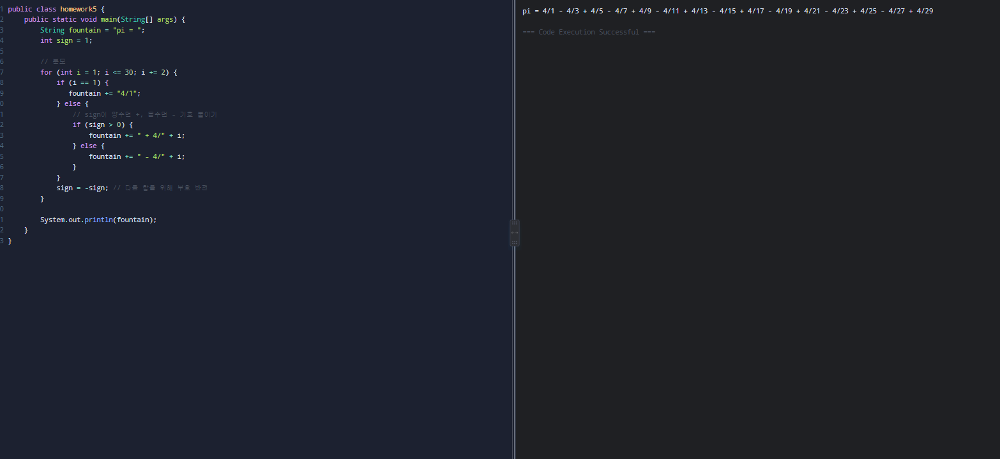
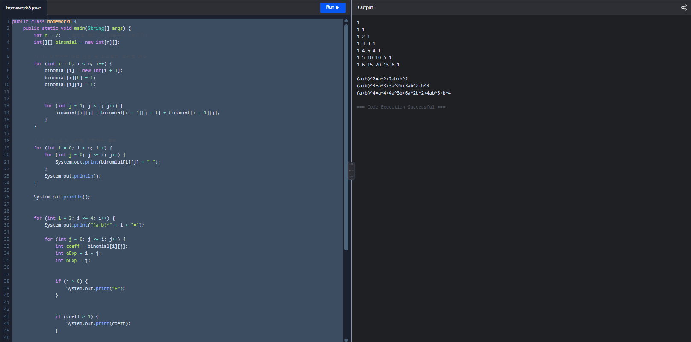
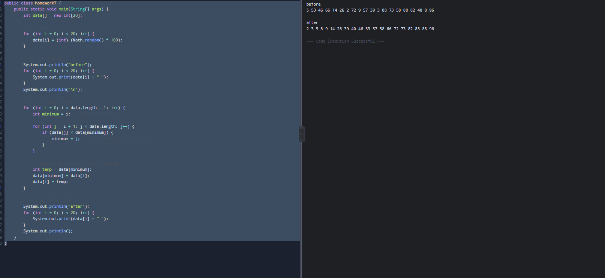
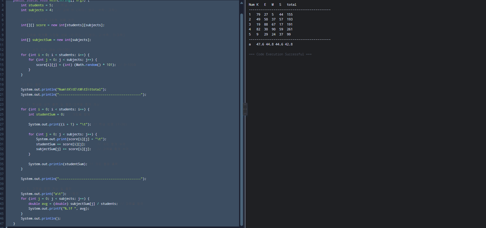

# OOP2023
### Homework1
```java
public class Homework1 {

	public static void main(String []args){

		int i, j;

		for(i=0; i<10; i++) {

			  for(j=0; j<=i; j++) {

			    System.out.print(" ");

			  }

			  for(; j<=10; j++) {

			    System.out.print("#");

			  }

			  System.out.println();

			}

		for(i=0; i<10; i++) {

			  for(j=0; j<=10-i; j++) {

			    System.out.print(" ");

			  }

			  for(; j<=10; j++) {

			    System.out.print("#");

			  }

			  System.out.println();

			}

		for(i=0; i<10; i++) {

			  for(j=0; j<=10-i; j++) {

			    System.out.print("#");

			  }

			  for(; j<=10; j++) {

			    System.out.print("");

			  }

			  System.out.println();

			}

		for(i=0; i<10; i++) {

			  for(j=0; j<=10-i; j++) {

			    System.out.print("");

			  }

			  for(; j<=10; j++) {

			    System.out.print("#");

			  }

			  System.out.println();

			}

	}

}
```


### Homework2
```java
public class homework2 {
    public static void main(String[] args) {
        int n = 20; 
        
        long first = 1;
        long second = 1;
        
        for (int i = 0; i < n; i++) {
            System.out.print(first + " ");

            long next = first + second;
            first = second;
            second = next;
        }
    }
}
```


### Homework3
```java
public class Homework3 {
    public static void main(String[] args) {
        int n = 20; 
        
        long first = 1;
        long second = 1;
        
        for (int i = 1; i <= n; i++) {
            if (i == 1) {
            } else {
                long next = first + second;
                double ratio = (double) second / first;
                
                System.out.printf("%d / %d\t\t%.10f\n", second, first, ratio);
                
                first = second;
                second = next;
            }
        }
    }
}
```


### Homework4
```java
public class Homework4 {
    public static void main(String[] args) {
        for (int i = 1; i <= 9; i++) {
            System.out.println("=== " + i + " ===");
            for (int j = 1; j <= 9; j++) {
                System.out.printf("%d x %d = %d\n", i, j, i * j);
            }
            System.out.println();
        }
    }
}
```


### Homework5
```java
public class homework5 {
    public static void main(String[] args) {
        String fountain = "pi = ";
        int sign = 1;

        // 분모
        for (int i = 1; i <= 30; i += 2) {
            if (i == 1) {
               fountain += "4/1";
            } else {
                // sign이 양수면 +, 음수면 - 기호 붙이기
                if (sign > 0) {
                    fountain += " + 4/" + i;
                } else {
                    fountain += " - 4/" + i;
                }
            }
            sign = -sign; // 다음 항을 위해 부호 반전
        }

        System.out.println(fountain);
    }
}
```


### Homework6
```java
public class homework6 {
    public static void main(String[] args) {
        int n = 7; // 출력할 행의 수 (0승부터 6승까지)
        int[][] binomial = new int[n][];

        // 1. 이항계수 배열 생성 및 파스칼의 삼각형 계산
        for (int i = 0; i < n; i++) {
            binomial[i] = new int[i + 1]; 
            binomial[i][0] = 1;         
            binomial[i][i] = 1;         

          
            for (int j = 1; j < i; j++) {
                binomial[i][j] = binomial[i - 1][j - 1] + binomial[i - 1][j];
            }
        }

        // 2. 파스칼의 삼각형 이항계수 출력
        for (int i = 0; i < n; i++) {
            for (int j = 0; j <= i; j++) {
                System.out.print(binomial[i][j] + " ");
            }
            System.out.println();
        }

        System.out.println(); 

       
        for (int i = 2; i <= 4; i++) {
            System.out.print("(a+b)^" + i + "=");

            for (int j = 0; j <= i; j++) {
                int coeff = binomial[i][j]; 
                int aExp = i - j;          
                int bExp = j;                

              
                if (j > 0) {
                    System.out.print("+");
                }

             
                if (coeff > 1) {
                    System.out.print(coeff);
                }

              
                if (aExp == 1) {
                    System.out.print("a");
                } else if (aExp > 1) {
                    System.out.print("a^" + aExp);
                }

              
                if (bExp == 1) {
                    System.out.print("b");
                } else if (bExp > 1) {
                    System.out.print("b^" + bExp);
                }
            }
            System.out.println();
        }
    }
}
```


### Homework7
```java
public class homework7 {
    public static void main(String[] args) {
        int data[] = new int[20];

        // 1. 랜덤
        for (int i = 0; i < 20; i++) {
            data[i] = (int) (Math.random() * 100);
        }

        // 2. 선택 정렬 전
        System.out.println("before");
        for (int i = 0; i < 20; i++) {
            System.out.print(data[i] + " ");
        }
        System.out.println("\n");

        // 3. 선택 정렬 알고리즘
        for (int i = 0; i < data.length - 1; i++) {
            int minimum = i; // 최솟값의 위치 기록

            for (int j = i + 1; j < data.length; j++) {
                if (data[j] < data[minimum]) {
                    minimum = j; // 더 작은 값을 찾으면 인덱스 갱신
                }
            }

            // 최솟값과 현재 위치(i)의 값을 교환(Swap)
            int temp = data[minimum];
            data[minimum] = data[i];
            data[i] = temp;
        }

        // 4. 정렬 후 배열 출력
        System.out.println("after");
        for (int i = 0; i < 20; i++) {
            System.out.print(data[i] + " ");
        }
        System.out.println();
    }
}


```


### Homework8
```java
public class Homework8 {
    public static void main(String[] args) {
        int students = 5; // 학생 수
        int subjects = 4;  // 과목 수 (국어, 영어, 수학, 과학)
        
        // 30명 x 4과목 2차원 배열 선언
        int[][] score = new int[students][subjects];
        
        // 과목별 합계를 저장할 배열 (0:국어, 1:영어, 2:수학, 3:과학)
        int[] subjectSum = new int[subjects];

        // 1. 성적 랜덤 생성 (0~100)
        for (int i = 0; i < students; i++) {
            for (int j = 0; j < subjects; j++) {
                score[i][j] = (int) (Math.random() * 101); // 0~100점
            }
        }

        // 헤더 출력
        System.out.println("Num\tK\tE\tM\tS\ttotal");
        System.out.println("-------------------------------------------");

        // 2. 학생별 성적 출력 및 총점/과목별 합계 계산
        for (int i = 0; i < students; i++) {
            int studentSum = 0; // 개인별 합계
            
            System.out.print((i + 1) + "\t"); // 학생 번호 (1~30)
            
            for (int j = 0; j < subjects; j++) {
                System.out.print(score[i][j] + "\t");
                studentSum += score[i][j];      // 개인 합계 누적
                subjectSum[j] += score[i][j];   // 과목별 합계 누적
            }
            
            System.out.println(studentSum); // 개인 총점 출력
        }

        System.out.println("-------------------------------------------");

        // 3. 과목별 평균 계산 및 출력
        System.out.print("a\t"); //평균
        for (int j = 0; j < subjects; j++) {
            double avg = (double) subjectSum[j] / students; // 과목별 평균
            System.out.printf("%.1f ", avg);               
        }
        System.out.println();
    }
}

```


### Homework11

package histogram11;

public class histogram11 {

	public static void main(String[] args) {
		// TODO Auto-generated method stub
		int array_count, max_value, bin_size, display_scale, hist_size;
		if(args.length !=4)
			return;
		array_count = Integer.parseInt(args[0]);
		max_value = Integer.parseInt(args[1]);
		bin_size = Integer.parseInt(args[2]);
		display_scale = Integer.parseInt(args[3]);
		hist_size = max_value/bin_size;
		
		int[] arr = new int[array_count];
		int[] hist = new int[hist_size];
		for (int i=0; i<array_count; i++) {
			arr[i] = (int) (Math.random()*max_value);
		}
		for (int i=0; i<array_count; i++) {
			System.out.print(arr[i] + " ");  
		}
		System.out.println();  
		
		for (int i=0; i<array_count; i++) {
			hist[arr[i]/bin_size]++;
		}
		for (int i=0; i<hist_size; i++) {
			System.out.print(hist[i] + " ");  
		}
		System.out.println();  
	}

	}


### Homework12

int 78 = 64 + 8 + 6 = 01001110
int -78 = 10110001 + 1 =10110010


