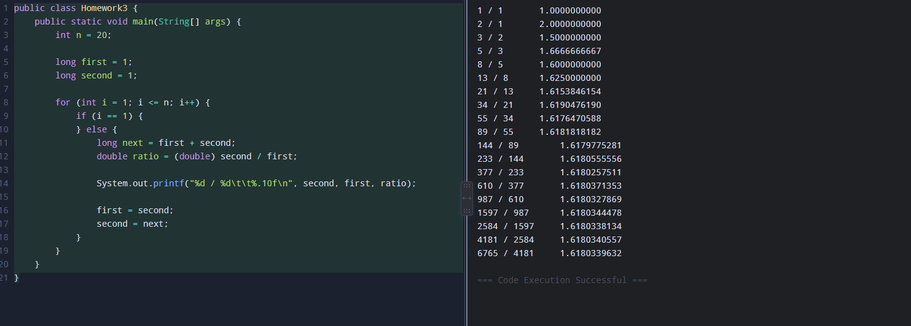
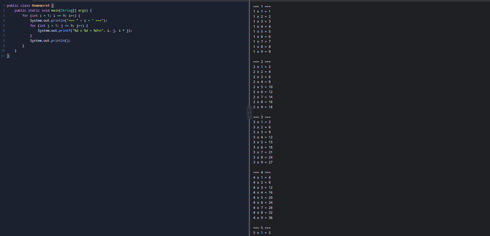

# OOP2023
### Homework1
```java
public class Homework1 {

	public static void main(String []args){

		int i, j;

		for(i=0; i<10; i++) {

			  for(j=0; j<=i; j++) {

			    System.out.print(" ");

			  }

			  for(; j<=10; j++) {

			    System.out.print("#");

			  }

			  System.out.println();

			}

		for(i=0; i<10; i++) {

			  for(j=0; j<=10-i; j++) {

			    System.out.print(" ");

			  }

			  for(; j<=10; j++) {

			    System.out.print("#");

			  }

			  System.out.println();

			}

		for(i=0; i<10; i++) {

			  for(j=0; j<=10-i; j++) {

			    System.out.print("#");

			  }

			  for(; j<=10; j++) {

			    System.out.print("");

			  }

			  System.out.println();

			}

		for(i=0; i<10; i++) {

			  for(j=0; j<=10-i; j++) {

			    System.out.print("");

			  }

			  for(; j<=10; j++) {

			    System.out.print("#");

			  }

			  System.out.println();

			}

	}

}
```


### Homework1
```java
public class homework2 {
    public static void main(String[] args) {
        int n = 20; 
        
        long first = 1;
        long second = 1;
        
        for (int i = 0; i < n; i++) {
            System.out.print(first + " ");

            long next = first + second;
            first = second;
            second = next;
        }
    }
}
```


### Homework3
```java
public class Homework3 {
    public static void main(String[] args) {
        int n = 20; 
        
        long first = 1;
        long second = 1;
        
        for (int i = 1; i <= n; i++) {
            if (i == 1) {
            } else {
                long next = first + second;
                double ratio = (double) second / first;
                
                System.out.printf("%d / %d\t\t%.10f\n", second, first, ratio);
                
                first = second;
                second = next;
            }
        }
    }
}
```


### Homework4
```java
public class Homework4 {
    public static void main(String[] args) {
        for (int i = 1; i <= 9; i++) {
            System.out.println("=== " + i + " ===");
            for (int j = 1; j <= 9; j++) {
                System.out.printf("%d x %d = %d\n", i, j, i * j);
            }
            System.out.println();
        }
    }
}
```


### Homework5
```java
public class homework5 {
    public static void main(String[] args) {
        String fountain = "pi = ";
        int sign = 1;

        // 분모
        for (int i = 1; i <= 30; i += 2) {
            if (i == 1) {
               fountain += "4/1";
            } else {
                // sign이 양수면 +, 음수면 - 기호 붙이기
                if (sign > 0) {
                    fountain += " + 4/" + i;
                } else {
                    fountain += " - 4/" + i;
                }
            }
            sign = -sign; // 다음 항을 위해 부호 반전
        }

        System.out.println(fountain);
    }
}
```

