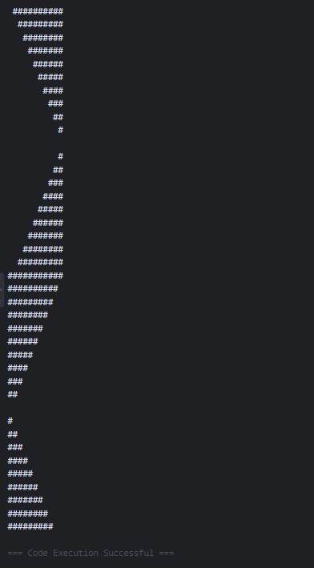
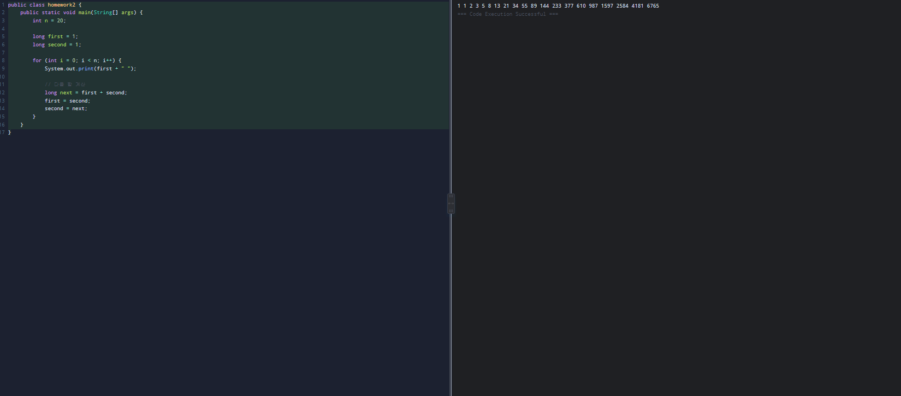

# OOP2023
### Homework1
```java
public class HomeWorld {

	public static void main(String []args){

		int i, j;

		for(i=0; i<10; i++) {

			  for(j=0; j<=i; j++) {

			    System.out.print(" ");

			  }

			  for(; j<=10; j++) {

			    System.out.print("#");

			  }

			  System.out.println();

			}

		for(i=0; i<10; i++) {

			  for(j=0; j<=10-i; j++) {

			    System.out.print(" ");

			  }

			  for(; j<=10; j++) {

			    System.out.print("#");

			  }

			  System.out.println();

			}

		for(i=0; i<10; i++) {

			  for(j=0; j<=10-i; j++) {

			    System.out.print("#");

			  }

			  for(; j<=10; j++) {

			    System.out.print("");

			  }

			  System.out.println();

			}

		for(i=0; i<10; i++) {

			  for(j=0; j<=10-i; j++) {

			    System.out.print("");

			  }

			  for(; j<=10; j++) {

			    System.out.print("#");

			  }

			  System.out.println();

			}

	}

}
```


### Homework1
```java
public class homework2 {
    public static void main(String[] args) {
        int n = 20; 
        
        long first = 0;
        long second = 1;
        
        for (int i = 0; i < n; i++) {
            System.out.print(first + " ");

            long next = first + second;
            first = second;
            second = next;
        }
    }
}
```

